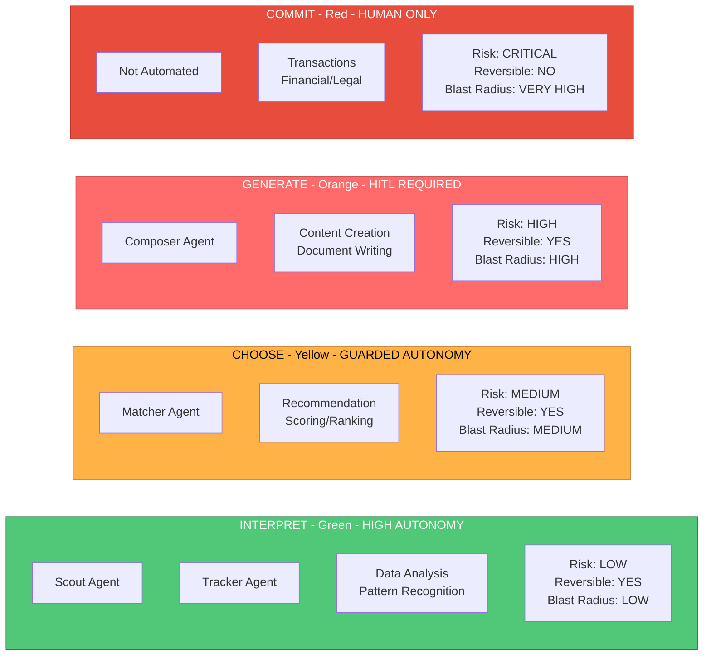

# 4 Buckets of Risk Matrix

## Visual Representation

```
┌─────────────────────────────────────────────────────────────────────────────┐
│                        AUTONOMY DECISION FRAMEWORK                          │
└─────────────────────────────────────────────────────────────────────────────┘

┌──────────────┬──────────────────┬─────────────────┬──────────────┬──────────┐
│   BUCKET     │   TASK TYPE      │   DESCRIPTION   │  AUTONOMY    │  AGENTS  │
├──────────────┼──────────────────┼─────────────────┼──────────────┼──────────┤
│              │                  │ Understanding   │              │          │
│  INTERPRET   │ Data Analysis    │ data, parsing   │     HIGH     │  Scout   │
│   (Green)    │ Pattern          │ patterns,       │  Autonomous  │  Tracker │
│              │ Recognition      │ classification  │              │          │
│              │                  │                 │              │          │
│  RISK: LOW   │ Reversible: YES  │ Blast Radius: LOW            │          │
├──────────────┼──────────────────┼─────────────────┼──────────────┼──────────┤
│              │                  │ Ranking,        │              │          │
│   CHOOSE     │ Recommendation   │ filtering,      │   GUARDED    │  Matcher │
│  (Yellow)    │ Scoring          │ prioritizing    │   Suggests   │          │
│              │ Filtering        │ options         │ User decides │          │
│              │                  │                 │              │          │
│  RISK: MED   │ Reversible: YES  │ Blast Radius: MEDIUM         │          │
├──────────────┼──────────────────┼─────────────────┼──────────────┼──────────┤
│              │                  │ Creating new    │              │          │
│  GENERATE    │ Content Creation │ content that    │     HITL     │ Composer │
│  (Orange)    │ Document         │ represents      │ Human Must   │          │
│              │ Writing          │ user identity   │   Approve    │          │
│              │                  │                 │              │          │
│  RISK: HIGH  │ Reversible: YES  │ Blast Radius: HIGH           │          │
├──────────────┼──────────────────┼─────────────────┼──────────────┼──────────┤
│              │                  │ Irreversible    │              │          │
│   COMMIT     │ Transactions     │ external        │    HUMAN     │   None   │
│    (Red)     │ Financial        │ actions with    │  REQUIRED    │  (Not    │
│              │ Legal            │ consequences    │              │automated)│
│              │                  │                 │              │          │
│  RISK: CRITICAL │ Reversible: NO │ Blast Radius: VERY HIGH      │          │
└──────────────┴──────────────────┴─────────────────┴──────────────┴──────────┘

┌─────────────────────────────────────────────────────────────────────────────┐
│                           SAFETY LENSES                                     │
│                                                                             │
│  1. REVERSIBILITY: Can we undo this action?                                │
│     → YES = More autonomy allowed                                          │
│     → NO = Human approval required                                         │
│                                                                             │
│  2. BLAST RADIUS: Who gets hurt if this fails?                             │
│     → Small = Autonomous execution okay                                    │
│     → Large = Human in the loop mandatory                                  │
└─────────────────────────────────────────────────────────────────────────────┘
```

## Mermaid Version (for rendering)


